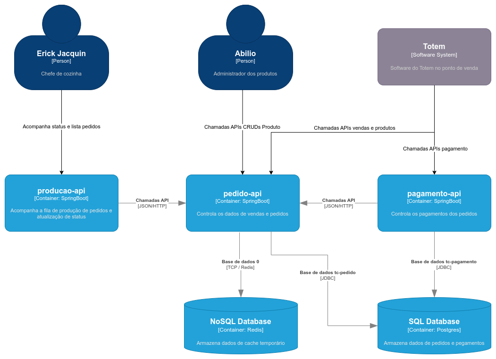
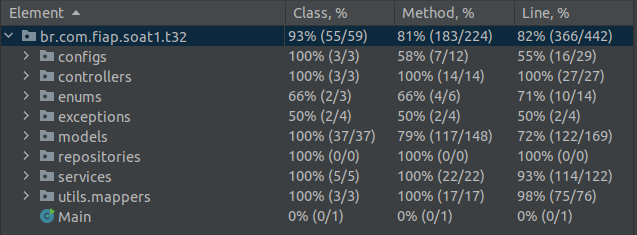
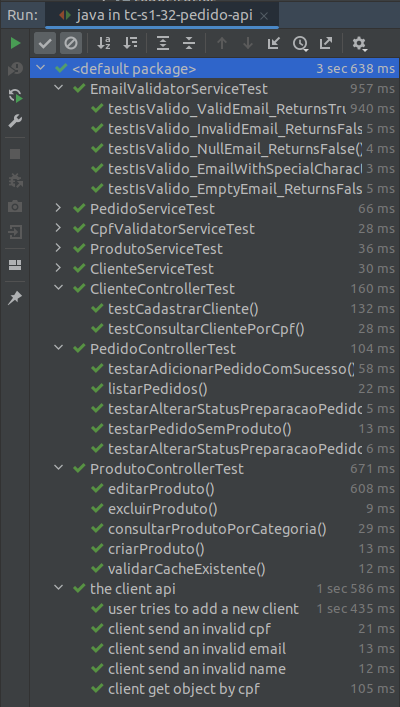
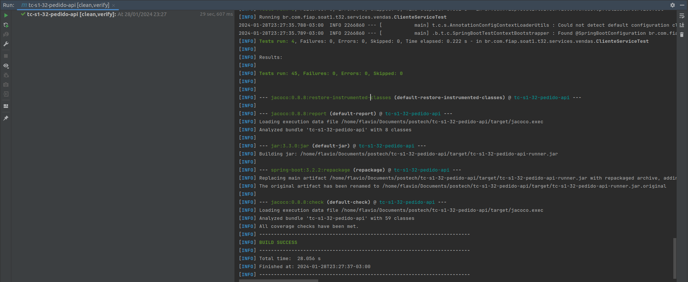
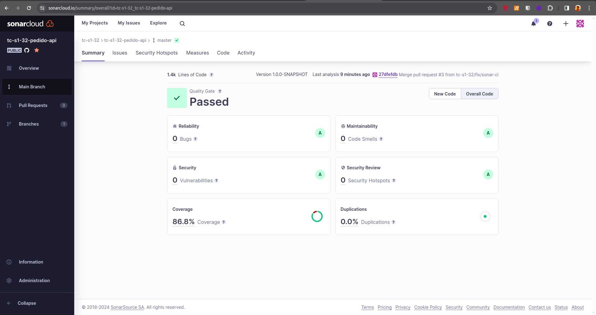

# PEDIDO API

Serviço responsável pelos domínios de pedidos e vendas. 
As principais funcionalidades são: 

- Criação do pedido
- Alteração do status do pedido
- Consulta de pedidos
- Cadastro de clientes
- Consulta de clientes por cpf
- Cadastro de produtos
- CRUD de produtos

## Diagrama Arquitetural da comunicação entre os serviços

## Definição dos pacotes

Os pacotes seguem uma estrutura simples de separação exemplificada a seguir:

- [configs](src%2Fmain%2Fjava%2Fbr%2Fcom%2Ffiap%2Fsoat1%2Ft32%2Fconfigs)

- [controllers](src%2Fmain%2Fjava%2Fbr%2Fcom%2Ffiap%2Fsoat1%2Ft32%2Fcontrollers)

- [enums](src%2Fmain%2Fjava%2Fbr%2Fcom%2Ffiap%2Fsoat1%2Ft32%2Fenums)

- [exceptions](src%2Fmain%2Fjava%2Fbr%2Fcom%2Ffiap%2Fsoat1%2Ft32%2Fexceptions)

- [models](src%2Fmain%2Fjava%2Fbr%2Fcom%2Ffiap%2Fsoat1%2Ft32%2Fmodels)

- [repositories](src%2Fmain%2Fjava%2Fbr%2Fcom%2Ffiap%2Fsoat1%2Ft32%2Frepositories)

- [services](src%2Fmain%2Fjava%2Fbr%2Fcom%2Ffiap%2Fsoat1%2Ft32%2Fservices)

- [mappers](src%2Fmain%2Fjava%2Fbr%2Fcom%2Ffiap%2Fsoat1%2Ft32%2Futils%2Fmappers)

## Definições de testes

Para os testes de unidade, foram considerados os pacotes <b>controllers</b> e <b>services</b>.

Para services, utilizamos o Mockito para mockar toda a camada repository e validar as regras de negócio isoladamente.

Nas controllers, fizemos o mock das services e validamos contratos das APIs.

Todos os testes de unidade são executados com a configuração padrão com banco h2.

Para o teste de integração que envolve o Redis também é iniciado um redis server embarcado.

A seguir a visualização da cobertura de teste usando a IDE:

Existe também uma suíte de testes em BDD da parte de cliente que é executada juntamente aos testes de unidade pela IDE, ou executando o arquivo cliente.feature.

No pom.xml está configurado para validar a cobertura de testes em 80%, conforme exemplo a seguir:

Existe também uma Github Action que analisa o código e a cobertura de testes, e submete o resultado para o SonarCloud.

URL de acesso: https://sonarcloud.io/summary/overall?id=tc-s1-32_tc-s1-32-pedido-api

